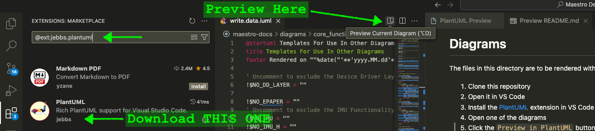

# Diagrams

The files in this directory are to be rendered with PlantUML. In order to make the best use of this project, follow these steps:

1. Clone this repository
1. Open it in VS Code
1. Install the [PlantUML](https://marketplace.visualstudio.com/items?itemName=jebbs.plantuml) extension in VS Code (or you can search for the extension ID of `jebbs.plantuml`)
1. Open one of the diagrams
1. Click the `Preview in PlantUML` button, located at the top, right of the text editor.

<a href="assets/PlantUML_Install.png">

Click to englarge
</a>

## Directories

### `core_functions`

The `.iuml` files within this directory are not meant to be used directly. The files are templates to be `i`ncluded in other `uml` diagrams. The templates are meant to streamline management of reusable functionality, like a button press or a login sequence.

To use a template in your `.puml` diagram, refer to the full documentation on [Including Subpart](https://plantuml.com/preprocessing#98ecfc06b2af9277).

### `sprite`

This directory is a dumping ground for sprites not normally included with the PlantUML JAR bundled with the VS Code PlantUML extension.

### `style`

This directory contains predefined style sheets to make the diagrams not look so generic. These set default styles for colors and other things, like the resolution of the diagram (i.e. `dpi`) or the default fonts to use for various components.

> <br/>
>
> _I'm slowly migrating some of the old-school `SkinParam` syntax over to the more modern `CSS`-style syntax._<br/>
> <br/>

### `utils`

This directory contains a couple files that will pull all the other elements together. The `common-header.iuml` file pulls all the third-party sprites that we can use into one spot. The `functions.iuml` contains several shortcut functions used throughout this implementation. These functions may be generic for any diagram, like writing formatted notes. In many cases, these functions are being replaced by VS Code Snippets - probably best to just start typing `puml-` and see what templates are available.

> <br/>
>
> ### A Quick Note About Snippets
> 
> A custom set of snippets are defined in this project's snippets file. The file is located on the path `.vscode/plantuml.code-snippets`. When editing a PlantUML file, try typing `puml-` to see all the auto-complete options available to you. I tried to include clear descriptions for each of the snippets so you understand what you're getting. Also, in some of the _participant_-oriented snippets, I added some regex magic to ensure the piecs of the snippet which need to be uppercase/lowercase are indeed just that.
> 
> Honestly, I feel like snippets are a much better option than creating reusable functions. At least for my typical workflow it seems that way. I'm leaving the `functions.iuml` in here anyway. I'm hoping it serves as a good reference for someone else considering a custom function (or maybe just a good example of what _not_ to do).
> 
> <br/>

## Design Directories

For now, the thought is to isolate the varous "flows" or "experiences" into their own directory. Within those directories I am creating a file called `_index.puml`. The underscore is simply to ensure it is easy to find. For the most part, the `_index.puml` represents the very high-level sequence of events. All the actors/participants should remain the same throughout the detailed diagrams to reduce confusion.

Reducing the confusion is further supported by the common file named `_participants.iuml`. The participants for each sequence diagram in the directory should be defined therein. This ensures consistency. It prevents someone from accidentally renaming or changing the definition of something in one diagram or another.

### Utility Functions

Include the `common.participants.iuml!MAIN` sub template in your own `_participants.iuml` files. Within that `_participants.iuml` file, you can add a configuration value to hide any of the participants you are not using. This may help to reduce the "busy-ness" of diagrams and make them easier for your readers to consume. Below is an example list of these "switches" you can use to hide participants.

> <details>
> <summary>Hint About Switches</summary>
> <br/>
> 
> To make this easier to use, a custom _"snippet"_ was added. Simnply start typing out `puml-xf` before pressing `ENTER` to insert some boilerplate variables. It would be a good idea to keep this snippet up-to-date as both the project and team grow.
> 
> <br/>
> </details>

<br/>
Since we are only checking for the existance of a variable, the value doesn't matter. Unfortunately, in PlantUML, it is not possible to simply declare a variable without assigning a value to it. Keeping it simple, we are just going to use an empty string.
<br/>
<br/>

> <details>
>    <summary>Expand to View the List of Optional Flags</summary>
>
> ```
> ' USERS
> ' Uncomment to exclude the entire set of "actors"
> ' !$NO_ACTORS = ""
> 
>     ' Uncomment to exclude the generic "User"
>     '!$NO_USER = ""
>
> 
> ' INFRASTRUCTURE SERVICES
> ' Uncomment to exclude the entire infrastructure box
> '!$NO_INFRA = ""
>     ' Uncomment to exclude the API Endpoint/Proxy
>     '!$NO_API = ""
>
>     ' Uncomment to exclude the Admin UI (i.e. "A Portal UI")
>     '!$NO_UI = ""
>
>     ' Uncomment to exclude the infrastructure administrator
>     '!$NO_ADMIN = ""
>
> 
> ' CLUSTER COMPONENTS
> ' Uncomment to exclude the entire Cluster Services box
> ' !$NO_CLUSTER = ""
>
>     ' Uncomment to exclude the Third Party Services
>     '!$NO_TPS = ""
>
>     ' Uncomment to exclude the Data Services
>     '!$NO_DB = ""
>
>     ' Uncomment to exclude the Certificate Services
>     '!$NO_CS = ""
>
>     ' Uncomment to exclude the Web Application Services
>     '!$NO_WEB = ""
>
> ```
> 
> </details>


#### Pattern for Exclusion Variables

If you try one the `puml-tp` snippet (for a `t`emplate `p`articipant), you'll notice it's wrapped in an `!if` statement. The statement checks whether or not a variable has been defined. Depending on the variable's existence, the participant is rendered in the diagram.

To make this simpler, I have defined the same variable in the VS Code snippet in two places. The only difference is one of them is automatically convereted to `UPPERCASE` when you press `ENTER` to accept your entry.


### What to Include

You can include the `common.participants.iuml` or, if you prefer to reorder the groups of participants, feel free to copy the contents of the `common.participants.iuml` into your sub-directory's `_participants.iuml` file.